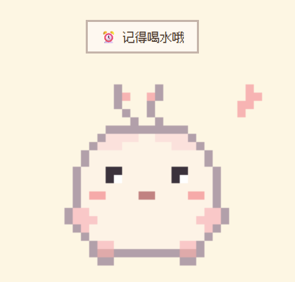
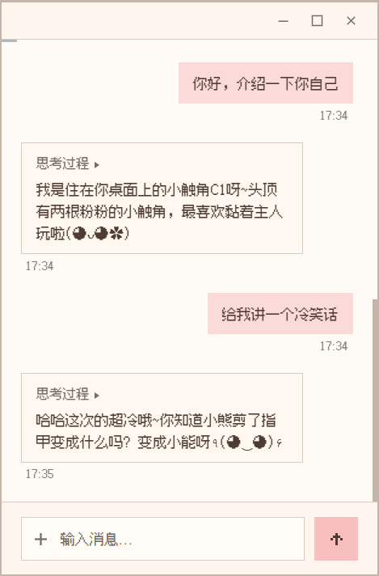
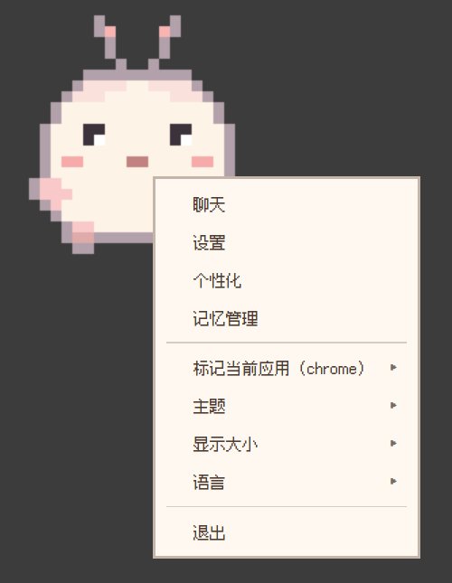
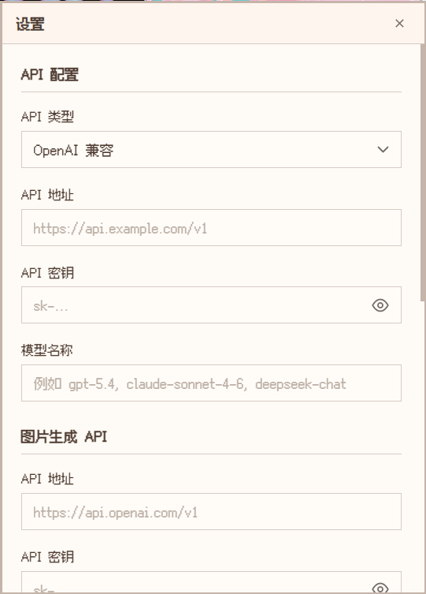
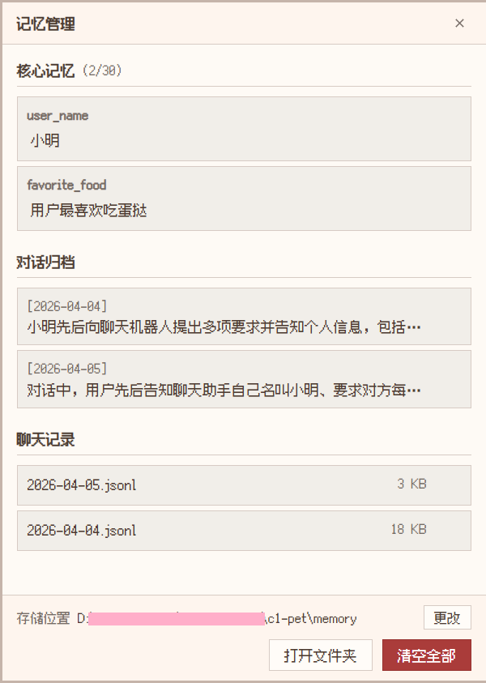
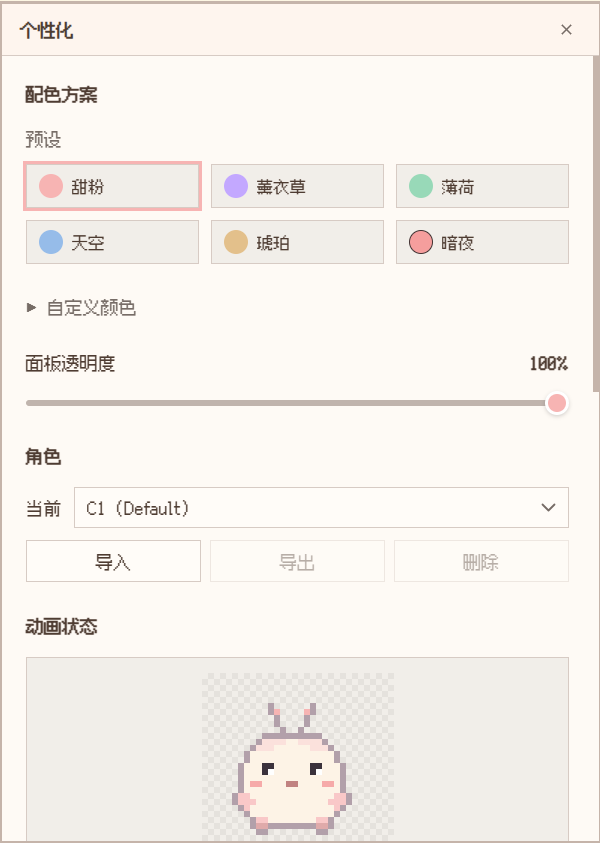
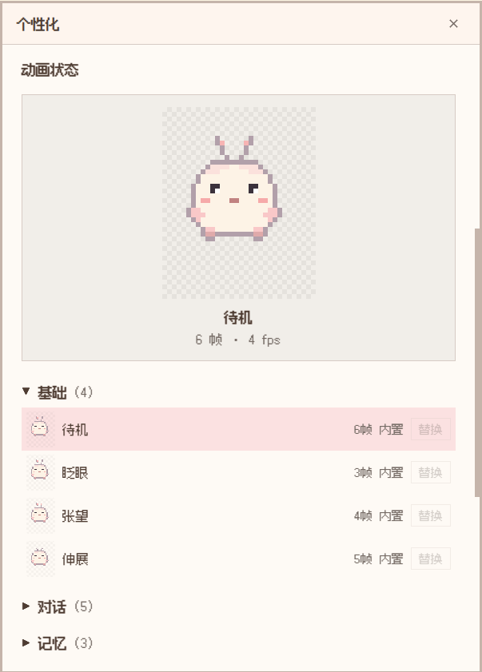

# C1 桌面宠物 - AI Desktop Pet

<p align="center">
  
</p>

<p align="center">
  <strong>一只有 AI 灵魂的像素风桌面宠物，陪你写代码、聊天、设提醒。</strong>
</p>

<p align="center">
  <a href="#安装">安装</a> |
  <a href="#功能特色">功能</a> |
  <a href="#配置">配置</a> |
  <a href="#english">English</a>
</p>

---

## 功能特色

**AI 聊天** - 支持 OpenAI 兼容格式和 Anthropic 原生 API。流式输出、思考过程、Markdown 渲染、代码高亮。

**39 个像素动画** - 手绘 32x32 像素风格，包含呼吸、眨眼、思考、开心、拖拽、睡觉等丰富动画，实时响应你的操作。

**智能行为** - 检测你的活动（写代码、浏览网页、玩游戏），夜晚会犯困，自己在桌面散步，主动找你聊天。

**记忆系统** - 三层记忆：核心记忆（用户偏好）、聊天记录、对话归档摘要。你的桌宠会记住你。

**内置工具** - 设定时提醒、获取当前时间、生成图片（需独立配置图片 API），通过 function calling 自然调用。

**深度自定义** - 6 套预设配色 + 自定义 8 色调色板、面板透明度、导入自定义角色、逐个动画替换。

**隐私优先** - 所有数据本地存储，API Key 使用系统级加密（DPAPI），无遥测，无云存储。

## 截图

<table>
<tr>
<td align="center"><strong>聊天面板</strong></td>
<td align="center"><strong>右键菜单</strong></td>
</tr>
<tr>
<td></td>
<td></td>
</tr>
<tr>
<td align="center"><strong>设置</strong></td>
<td align="center"><strong>记忆管理</strong></td>
</tr>
<tr>
<td></td>
<td></td>
</tr>
<tr>
<td align="center"><strong>个性化 - 配色预设</strong></td>
<td align="center"><strong>个性化 - 动画状态</strong></td>
</tr>
<tr>
<td></td>
<td></td>
</tr>
</table>

## 安装

### 下载安装（推荐）

1. 前往 [Releases](../../releases) 页面
2. 下载 `C1 Desktop Pet Setup x.x.x.exe`
3. 运行安装程序，选择安装位置
4. 从桌面快捷方式或开始菜单启动

### 从源码运行

需要 [Node.js](https://nodejs.org/)（v18+）和 [pnpm](https://pnpm.io/)。

```bash
git clone https://github.com/OvOasdfgh/ai-desktop-pet-c1.git
cd ai-desktop-pet-c1
pnpm install
pnpm start
```

构建安装包：

```bash
pnpm run build
# 输出: dist/C1 Desktop Pet Setup x.x.x.exe
```

## 配置

### API 设置

右键桌宠 > **设置**：

| 设置项 | 说明 |
|--------|------|
| API 类型 | OpenAI 兼容 / Anthropic |
| API 地址 | 如 `https://api.openai.com/v1` |
| API 密钥 | 本地 DPAPI 加密存储 |
| 模型名称 | 如 `gpt-4o`、`claude-sonnet-4-6`、`deepseek-chat` |

**不接 API 也是完整桌宠**——所有动画和交互功能均可正常使用，AI 聊天是增强功能。

### 图片生成（可选）

独立的图片 API 配置（OpenAI 兼容格式）。配置后可通过自然对话让桌宠生成图片。

## 使用方法

| 操作 | 方式 |
|------|------|
| 打开聊天 | 点击桌宠 / 右键 > 聊天 |
| 拖拽 | 按住拖动桌宠 |
| 抚摸 | 长按桌宠 |
| 戳一下 | 单击桌宠 |
| 抛掷 | 拖动后快速松开 |
| 右键菜单 | 右键点击桌宠 |
| 发送消息 | Enter 发送，Shift+Enter 换行 |
| 发送图片 | 点击 +、粘贴 Ctrl+V、或拖放图片 |
| 设置提醒 | 自然语言，如"5分钟后提醒我喝水" |

## 个性化

右键桌宠 > **个性化**：

- **配色预设**：甜粉、薰衣草、薄荷、天空、琥珀、暗夜
- **自定义颜色**：独立调整 8 个颜色通道
- **面板透明度**：调节所有面板的不透明度
- **自定义角色**：导入自己的角色包
- **动画替换**：逐个替换动画状态的精灵图

## 数据存储

所有用户数据存储在 `%APPDATA%/c1-pet/`：

| 数据 | 位置 |
|------|------|
| 配置文件 | `config.json` |
| API 密钥 | 加密存储在配置中 |
| 核心记忆 | `memory/core.json` |
| 聊天记录 | `memory/chats/*.jsonl` |
| 对话归档 | `memory/archive.jsonl` |
| 自定义角色 | `characters/` |
| 动画覆盖 | `state-overrides/` |

卸载应用**不会**删除你的数据。如需完全清除，手动删除 `%APPDATA%/c1-pet/` 文件夹。

## 许可证

[MIT](LICENSE)

---

# English

## C1 Desktop Pet - AI Desktop Companion

<p align="center">
  
</p>

<p align="center">
  <strong>An AI-powered pixel art desktop pet that lives on your screen.</strong><br>
  Chat, set reminders, generate images, and enjoy 39 hand-crafted animations.
</p>

## Features

**AI Companion** - Chat with your desktop pet using OpenAI-compatible or Anthropic APIs. Streaming responses with thinking process, Markdown rendering, and code highlighting.

**39 Pixel Animations** - Hand-drawn 32x32 pixel art with idle breathing, emotions, interactions, and contextual behaviors. The pet reacts to your actions in real-time.

**Smart Behaviors** - Detects your activity (coding, browsing, gaming), gets sleepy at night, walks around your desktop, and proactively starts conversations.

**Memory System** - Three-tier memory: core memories (user preferences), chat logs, and archived conversation summaries. Your pet remembers you across sessions.

**Built-in Tools** - Set reminders, get current time, generate images (with separate image API), and express emotions through function calling.

**Full Customization** - 6 color presets + custom 8-color palette, adjustable panel transparency, custom character import, and per-animation sprite replacement.

**Privacy First** - All data stored locally. API keys encrypted with OS-level protection (DPAPI). No telemetry, no cloud storage.

## Installation

### Download (Recommended)

1. Go to the [Releases](../../releases) page
2. Download `C1 Desktop Pet Setup x.x.x.exe`
3. Run the installer and choose your install location
4. Launch from the desktop shortcut or Start Menu

### Build from Source

Requires [Node.js](https://nodejs.org/) (v18+) and [pnpm](https://pnpm.io/).

```bash
git clone https://github.com/OvOasdfgh/ai-desktop-pet-c1.git
cd ai-desktop-pet-c1
pnpm install
pnpm start
```

To build the installer:

```bash
pnpm run build
# Output: dist/C1 Desktop Pet Setup x.x.x.exe
```

## Configuration

### API Setup

Right-click the pet > **Settings** to configure:

| Setting | Description |
|---------|-------------|
| API Type | OpenAI Compatible / Anthropic |
| API Endpoint | e.g. `https://api.openai.com/v1` |
| API Key | Encrypted locally with DPAPI |
| Model Name | e.g. `gpt-4o`, `claude-sonnet-4-6`, `deepseek-chat` |

The pet works without an API - you get all animations and interactions. AI chat is an enhancement, not a requirement.

### Image Generation (Optional)

Separate API configuration for image generation (OpenAI-compatible format). When configured, you can ask the pet to generate images through natural conversation.

## Usage

| Action | How |
|--------|-----|
| Open chat | Click the pet or right-click > Chat |
| Drag | Click and drag the pet |
| Pet | Long press on the pet |
| Poke | Single click |
| Throw | Drag and release quickly |
| Right-click menu | Right-click the pet |
| Send message | Enter to send, Shift+Enter for new line |
| Send image | Click +, paste (Ctrl+V), or drag & drop |
| Set reminder | Ask naturally, e.g. "remind me in 5 minutes" |

## Customization

Right-click the pet > **Customize**:

- **Color Presets**: Sweet Pink, Lavender, Mint, Sky, Amber, Dark Night
- **Custom Colors**: Fine-tune 8 color channels individually
- **Panel Transparency**: Adjust opacity of all panels
- **Custom Characters**: Import character packs with their own animations
- **Animation Replacement**: Replace individual animation states with custom sprites

## Data Storage

All user data is stored in `%APPDATA%/c1-pet/`:

| Data | Location |
|------|----------|
| Configuration | `config.json` |
| API Keys | Encrypted in config |
| Memory | `memory/core.json` |
| Chat Logs | `memory/chats/*.jsonl` |
| Archives | `memory/archive.jsonl` |
| Custom Characters | `characters/` |
| State Overrides | `state-overrides/` |

Uninstalling the app does **not** delete your data. To fully remove, delete the `%APPDATA%/c1-pet/` folder manually.

## Tech Stack

| Component | Technology |
|-----------|-----------|
| Framework | Electron 41 |
| Animation | Sprite Sheet + Canvas |
| AI | OpenAI-compatible + Anthropic native APIs |
| Markdown | marked + highlight.js + DOMPurify |
| Package Manager | pnpm |

## Project Structure

```
src/
├── main.js                  # Main process (windows, IPC, AI, tools)
├── config.js                # Configuration with encrypted storage
├── ai/                      # AI provider abstraction
│   ├── ai-manager.js        # Token estimation, context building
│   ├── provider.js          # Base class + factory
│   ├── openai-provider.js   # OpenAI-compatible streaming
│   └── anthropic-provider.js # Anthropic native streaming
├── renderer/
│   ├── SpriteRenderer.js    # Canvas rendering + hit detection
│   ├── StateMachine.js      # Priority-based state machine
│   ├── SystemBehaviorManager.js  # Activity detection + behaviors
│   ├── InteractionManager.js     # Mouse interactions
│   ├── chat/                # Chat panel (independent window)
│   ├── settings/            # Settings panel
│   ├── customize/           # Customization panel
│   ├── memory/              # Memory management panel
│   ├── bubble/              # Notification bubble
│   └── context-menu/        # Custom right-click menu
├── i18n/                    # English + Simplified Chinese
└── data/                    # App category detection rules
output/
├── states.json              # Animation metadata (39 states, 181 frames)
└── sheets/                  # Sprite sheets (one per animation)
tools/                       # Python scripts for sprite generation
```

## For Developers

### Animation System

The animation system uses a diff-based frame generation architecture:

- **Component library**: ~10 eyes, 7 mouths, 17 antennae, ~7 hands, ~17 overlay elements
- **39 animation states** across 9 groups: Basic, Conversation, Memory, Proactive, User Interaction, Emotions, Environment, Movement, Multimedia
- **Sprite sheets**: One horizontal strip per state, 32x40px frames (with 4px padding)

To regenerate animations (requires Python):

```bash
cd tools
python generate_sprites.py
```

### Custom Character Packs

A character pack is a folder containing:
- `meta.json` - Character name, author, description
- `states.json` - Animation state definitions
- `sheets/` - Sprite sheet PNGs

See the built-in C1 character for reference.

## License

[MIT](LICENSE)
